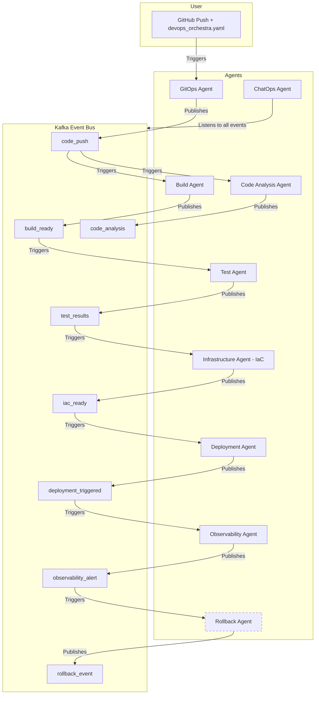

# DevOps-Orchestra
DevOps Orchestra: A Multi-Agent AI-Powered DevOps Automation System

## Project Description
DevOps Orchestra is a modular, event-driven DevOps automation platform powered by AI agents. It automates the entire software delivery lifecycle—from code validation and infrastructure provisioning to testing, deployment, monitoring, and recovery—by orchestrating a team of specialized agents. Each agent is responsible for a distinct DevOps function and communicates with others via a shared Kafka event bus, enabling fully automated, self-healing CI/CD pipelines.

## Architecture & Agent Flow

**Key Concepts:**
- **Event-Driven:** All agents communicate and trigger actions via Kafka topics, ensuring loose coupling and scalability.
- **Stateful:** Each agent updates a shared state object, allowing context-aware decisions and handoffs.
- **Config-Driven:** The pipeline is governed by a `devops_orchestra.yaml` file in each repo, specifying build, test, deployment, infra, and notification preferences.

### Agent Roles and Flow

1. **GitOps Agent**
   - **Role:** Entry point. Detects code pushes, clones repos, validates YAML, audits licenses, and updates the shared state.
   - **Kafka Topics:** Publishes to `code_push`.

2. **Build Agent**
   - **Role:** Builds the application using the specified tool (Docker, Maven, NPM, etc.). Generates Dockerfiles if missing.
   - **Kafka Topics:** Listens to `code_push`, publishes to `build_ready`.

3. **Code Analysis Agent**
   - **Role:** Performs static code analysis using LLMs, updates state with results, and publishes analysis events.
   - **Kafka Topics:** Listens to `code_push`, publishes to `code_analysis`.

4. **Test Agent**
   - **Role:** Auto-generates and runs tests using LLMs and the specified framework. Publishes results.
   - **Kafka Topics:** Listens to `build_ready`, publishes to `test_results`.

5. **Infrastructure Agent (IaC Agent)**
   - **Role:** Provisions cloud infrastructure using Terraform or CloudFormation, based on config. Generates missing IaC files using LLMs.
   - **Kafka Topics:** Listens to `test_results`, publishes to `iac_ready`.

6. **Deployment Agent**
   - **Role:** Deploys the application to the cloud using the specified strategy (e.g., blue-green, canary). Updates state with deployment status.
   - **Kafka Topics:** Listens to `iac_ready`, publishes to `deployment_triggered`.

7. **Observability Agent**
   - **Role:** Monitors deployed resources for health, latency, and error rates. Collects metrics (CPU, memory, disk, network, latency, error rates) and publishes alerts if thresholds are breached. Configurable thresholds via `devops_orchestra.yaml`.
   - **Kafka Topics:** Listens to `deployment_triggered`, publishes to `observability_alert`.

8. **Rollback Agent**
   - **Role:** Listens for critical failures or alerts. Triggers rollback to a previous version or runs `terraform destroy` as needed.
   - **Kafka Topics:** Listens to `rollback_event`.

9. **ChatOps Agent**
   - **Role:** Sends notifications (e.g., deployment success/failure, rollbacks) to users via Slack or other platforms, based on config.
   - **Kafka Topics:** Listens to various events, sends messages if enabled.

### Event Bus (Kafka) Usage

- **Kafka** is the backbone of agent communication. Each agent listens to and publishes on specific topics, enabling asynchronous, decoupled workflows.
- **Topics include:** `code_push`, `build_ready`, `code_analysis`, `test_results`, `iac_ready`, `deployment_triggered`, `observability_alert`, `rollback_event`.
- **Event schemas** are defined in `shared_modules/kafka_event_bus/event_schema.py` for consistency and validation.

---

## Architecture Diagram

*Dashed node indicates planned/under development.*

---

## Pipeline Flow Example

1. **Code push** triggers the GitOps Agent.
2. **Build Agent** builds the app.
3. **Code Analysis Agent** checks code quality.
4. **Test Agent** generates and runs tests.
5. **IaC Agent** provisions cloud infrastructure.
6. **Deployment Agent** deploys the app.
7. **Observability Agent** monitors health.
8. **Rollback Agent** triggers if health checks fail.
9. **ChatOps Agent** notifies users of key events.

---

**Note:**
- All agents are implemented and working. The system provides a complete self-healing, fully automated pipeline.
- All configuration is driven by the `devops_orchestra.yaml` file in each repository.
