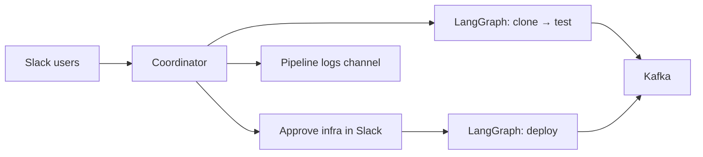

# DevOps Orchestra

**Multi-agent, AI-assisted DevOps automation** driven by a Slack coordinator, **LangGraph** pipelines, and **Kafka** events. One run clones your repo, validates `devops_orchestra.yaml`, indexes code, runs **Sonar** analysis, builds, generates and runs tests (optionally grounded in **Jira**), plans **Terraform**, and deploys—with human approval where needed.

## Highlights

| Area | What you get |
|------|----------------|
| **Entry** | Slack (Socket Mode)—no public GitHub webhook required if events land in Slack |
| **Pipeline** | LangGraph graphs for GitOps+agents and for infra plan → (approve) → deploy |
| **State** | Shared `DevOpsAgentState`; Kafka topics for cross-component observability |
| **Config** | Per-repo `devops_orchestra.yaml` (validated schema) |

## Documentation

| Doc | Purpose |
|-----|---------|
| [docs/README.md](docs/README.md) | Documentation index |
| [docs/SETUP.md](docs/SETUP.md) | Install, Docker, `.env`, Sonar |
| [docs/CONFIGURATION.md](docs/CONFIGURATION.md) | Slack, Jira, channels, tokens |
| [docs/ARCHITECTURE_1_TO_2.md](docs/ARCHITECTURE_1_TO_2.md) | Evolution of the coordinator + graphs |
| [docs/FEATURES.md](docs/FEATURES.md) | Features and recent additions |
| [docs/FUTURE_SCOPE.md](docs/FUTURE_SCOPE.md) | Roadmap ideas |
| [.env.example](.env.example) | Environment variable template |

## Quick start

```bash
cp .env.example .env
# Edit .env (Slack, Groq, Jira, Sonar, …)
docker compose up --build
```

Invite the bot to your **command** channel; send a pipeline trigger (e.g. run request for a branch). Use a **pipeline logs** channel or webhook for step-by-step output.

## Repository layout (abbrev.)

```
coordinator/          # Slack gateway, pipeline handler, failure suggestions
agents/               # GitOps, build, test, code analysis, infra, deploy, …
langgraph_flows/      # Compiled LangGraph pipelines (full pipeline, infra, deploy)
shared_modules/       # State, Kafka, LLM wrapper, utils
```

## Architecture (conceptual)


```mermaid
flowchart LR
  U[Slack users] --> C[Coordinator]
  C --> G1[LangGraph: clone → test]
  G1 --> K[Kafka]
  C --> A[Approve infra in Slack]
  A --> G2[LangGraph: deploy]
  G2 --> K
  C --> L[Pipeline logs channel]
```

## License / contributing

Add your license file if not present. Prefer issues and PRs that keep **state** and **Kafka** contracts backward compatible.
