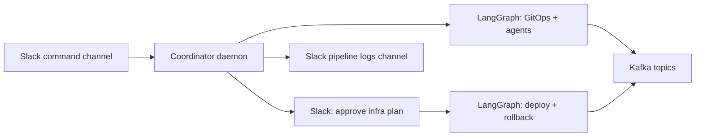

# Architecture 1.0 → 2.0 transition

This document replaces the former “architecture plan” doc. It summarizes how the system moved from an earlier, HTTP/GitHub-centric mental model to the current **Slack-first coordinator + LangGraph + Kafka** design.

## 1.0 (historical / conceptual)

- **Trigger:** Often described as GitHub webhooks or a Flask entrypoint pushing events into the system.
- **Orchestration:** Agents wired primarily through **Kafka** consumption patterns; LangGraph “combined” flows existed but the **full pipeline** (clone → validate → … → deploy) was not always expressed as **one** coherent graph.
- **Human input:** Failure handling and notifications were less unified (single webhook, fewer structured Slack channels).

## 2.0 (current)

- **Trigger:** **Slack only** for the coordinator—users (or GitHub events mirrored into Slack) post in a **command channel**. No public HTTP webhook is required for GitHub if events arrive in Slack.
- **Orchestration:**
  - **LangGraph** runs the **GitOps + agent** pipeline as a **single compiled graph** (`clone` → validate → repo metrics → index → Sonar/code analysis → build → test), with retries and **skip flags** stored in shared state.
  - A **second graph** runs **infra plan generation**; after **Slack approval**, a **deploy graph** runs deploy + rollback edges.
- **State:** `DevOpsAgentState` remains the source of truth; **Kafka** topics carry step events for observability (`gitops_pipeline`, `code_analysis`, `build_ready`, `test_results`, `iac_ready`, `deployment_triggered`, etc.).
- **Human-in-the-loop:** Failures surface in Slack with **LLM-assisted** suggestions; users can **retry**, **skip** a stage (updates `PipelineSkips`), or **continue** after Sonar issues.

## Migration notes for operators

- Prefer **two Slack channels**: command (triggers + questions) and pipeline logs (step outcomes).
- Ensure **topic auto-creation** runs (Kafka admin) so new topics like `gitops_pipeline` exist.
- Repos must ship **`devops_orchestra.yaml`** validated by the bundled schema (or user skips validation explicitly).

## Diagram (high level)

